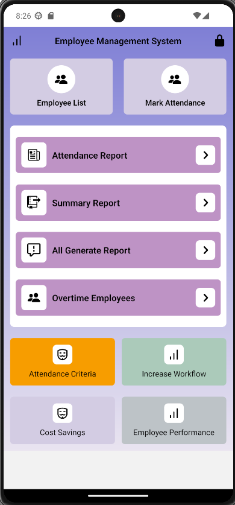
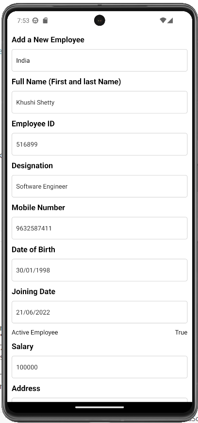
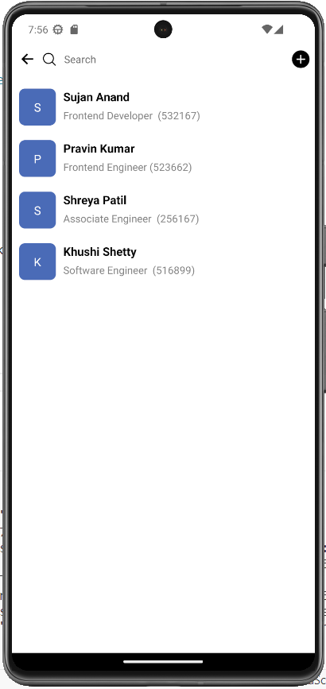
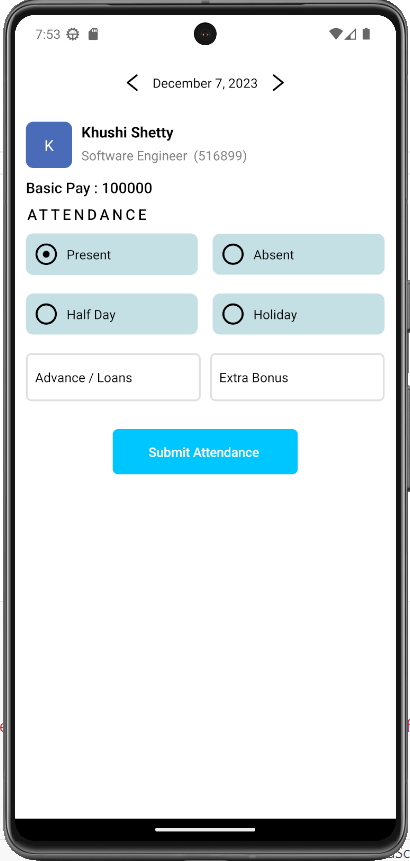
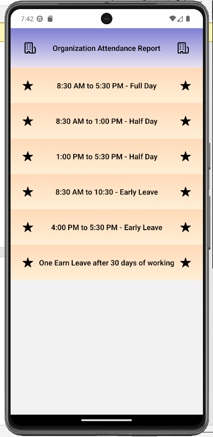
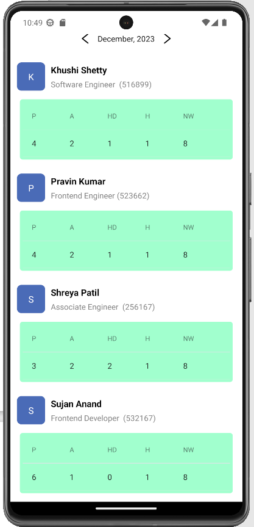

# 🧑‍💼 Employee Management System

## 📱 Full-Stack Mobile Application for Employee & Attendance Management

- The Employee Management System is a full-stack mobile application designed to manage employee records, track daily attendance, and generate summary reports. It provides a centralized platform for HR/Admin users to efficiently handle employee information, attendance policies, and summary analytics.
- This project is built using React Native (Expo) for the frontend, Node.js for backend services, and MongoDB as the database, showcasing a real-world enterprise-style employee management workflow.

---

## ✨ Key Highlights

- 📱 Cross-platform mobile application (Android / iOS)

- 🧾 Complete employee lifecycle management

- ⏱️ Daily attendance tracking with multiple attendance states

- 📊 Monthly and organization-level reports

- 🧠 Clean UI with scalable architecture

- 🔗 RESTful API integration with MongoDB

---

## 🛠️ Technology Stack

1. **Frontend**

- React Native
- Expo
- JavaScript

2. **Backend**

- Node.js
- REST APIs

3. **Database**

- MongoDB

-----

## Application Modules & Screens

1. **🏠 Dashboard / Home Screen**
- Provides quick access to employee management, attendance marking, reports, and organizational insights.

2. **➕ Add Employee Module**
- Allows administrators to add complete employee details such as personal information, designation, salary, joining date, and employment status.

- Captured Fields:
Full Name
Employee ID
Designation
Mobile Number
Date of Birth
Joining Date
Salary
Address
Active Employee Status

3. **📋 Employee List Module**
- Displays all employees in a structured list view with employee name, designation, and employee ID. Enables quick access to employee-specific attendance records.

4. **🕒 Attendance Management Module**

- Allows marking daily attendance using multiple options:
Present
Absent
Half Day
Holiday

Additional inputs include:
Advance / Loan
Extra Bonus

5. **📜 Attendance Criteria Module**

Defines organizational attendance rules such as:
Full day working hours
Half day timings
Early leave conditions
Earned leave policy
Ensures standardized attendance tracking across the organization.

6. **📊 Monthly Summary Report**

Displays monthly attendance summaries for each employee, including:
Present Days (P)
Absent Days (A)
Half Days (HD)
Holidays (H)
Non-Working Days (NW)
Useful for payroll processing and performance evaluation.

----

## 🎯 Use Cases

- HR & Admin employee management systems
- Attendance tracking and reporting
- Payroll preparation support
- Academic & learning projects
- Full-stack mobile app portfolio showcase
